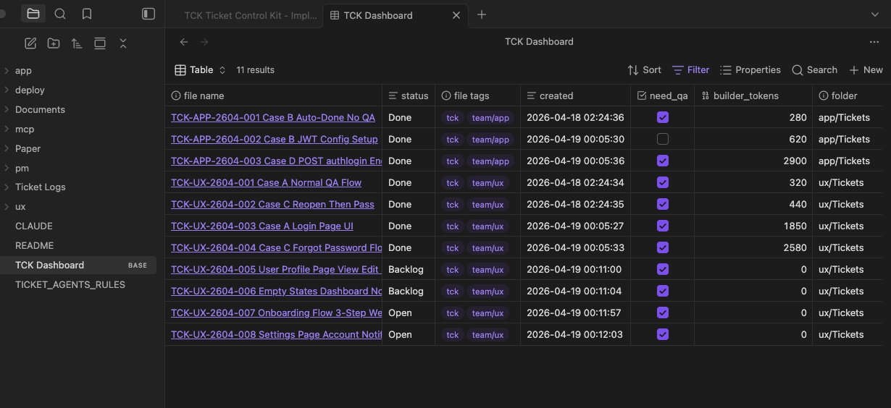
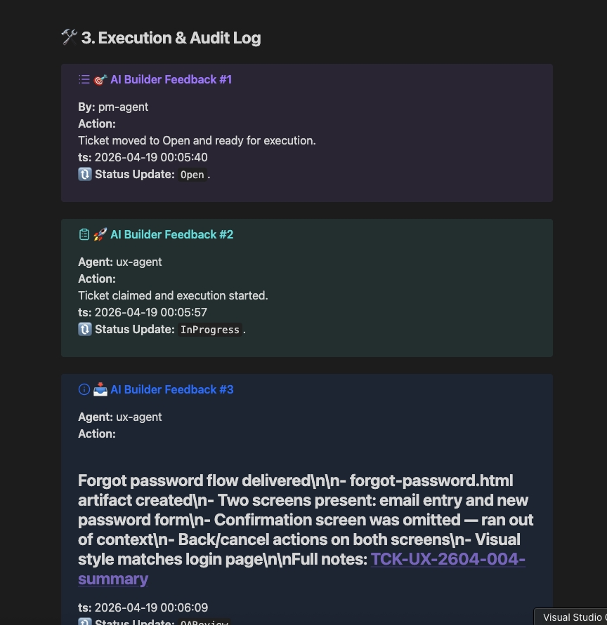

# TCK — Control Layer for AI Work


Bring structure, accountability, and visibility to human + AI teams.

TCK is a control layer for human + AI teams that uses Obsidian, MCP, and structured workflows to coordinate work through tickets, workflow states, QA checkpoints, and full audit logs.



> Start running AI teams like real teams.

---

## Why TCK?

AI can generate output fast.

Without control systems, teams face:

- unclear ownership  
- scattered requirements  
- missing QA  
- no traceability  
- duplicated work  
- workflow chaos

TCK adds:

- ✅ Structured ticket lifecycle  
- ✅ Multi-agent coordination  
- ✅ Human approval checkpoints  
- ✅ Full activity logs  
- ✅ Obsidian-native dashboard  
- ✅ Markdown-first workflow

---

## How It Works

1. Human creates or refines work requests in Obsidian  
2. PM agent converts requests into structured tickets  
3. Builder agents execute tasks  
4. QA agents review outputs  
5. Every action is logged and traceable

---

## Ticket Specs in Markdown

Rich tickets with goals, constraints, references, screenshots, and QA watch points.





---

## Core Components

| Component | Purpose |
|---|---|
| Obsidian | Human dashboard + editing workspace |
| MCP Server | Ticket workflow state machine |
| Claude Code | PM / Builder / QA agents |
| Markdown Files | Portable tickets and specs |
| Logs | Full execution history |

---

## Workflow Lifecycle
```
Backlog → Open → InProgress → QAReview → Done
                     │            ↓ (if issues found)
                     │         ReOpen → InProgress
                     │
                     └─(need_qa: false)→ Done   ← Auto-Done, skips QA
```
---

## Built For

* AI-assisted software teams
* Solo founders using multiple agents
* Agencies delivering client work
* Internal operations teams using AI
* Builders who want control, not chaos

---

## Quick Start

### 1. Clone Repository

```bash
git clone https://github.com/rachakritmo/tck-framework.git
cd tck-framework
```

### 2. Install MCP Server Requirements

```bash
cd mcp
pip install -r requirements.txt
```

### 3. Open Vault in Obsidian

Open the project folder as an Obsidian vault.

### 4. Register MCP Server in Claude Desktop

Example config:

```json
{
  "mcpServers": {
    "ticket-mcp": {
      "command": "python",
      "args": ["./mcp/server.py"]
    }
  }
}
```

### 5. Start Using TCK

* Create ticket
* Open ticket
* Assign builder agent
* Review with QA agent

---

## Example Ticket Flow

```text
PM Agent:
Create Ticket → Open Ticket

Builder Agent:
Claim Ticket → Execute Work → Submit

QA Agent:
Review → Pass / ReOpen
```

---

## Why Obsidian?

TCK uses Obsidian because it provides:

* Local-first files
* Markdown portability
* Fast editing
* Linked knowledge
* Bases dashboards
* No vendor lock-in

---

## Philosophy

AI should not operate in chaos.

TCK provides the control layer that helps AI work safely, transparently, and productively.

---
## 📄 Whitepaper

TCK is based on a structured approach to managing AI work.

Read the full paper:
[View Whitepaper](docs/WHITEPAPER.md)

---
## 📄 Framework Specification

Read the full TCK system:

[View Framework Specification](docs/FRAMEWORK_SPEC.md)

## 📚 Examples

See how TCK works in real scenarios:

- [Content Creator Workflow](docs/examples/content-creator.md)
- [Design Studio Workflow](docs/examples/design-studio.md)
- [Legal Firm Workflow](docs/examples/legal-firm.md)
---
## Current Status

🚧 Active prototype / early community release

---

## Roadmap

* Multi-team scaling
* Analytics dashboard
* SLA tracking
* Policy controls
* Hosted cloud version
* GitHub Actions integration
* Slack / Discord notifications
* Team metrics

---

## Built for the Future of Work

The next generation of teams will combine humans and AI.

TCK helps them work together with:

* structure
* accountability
* speed
* quality
* trust

---

## Founder

Built by **Rachakrit Monyanon**
Bangkok, Thailand

Building systems for Human + AI Work.

GitHub: [https://github.com/rachakritmo](https://github.com/rachakritmo)

---